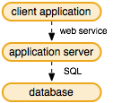
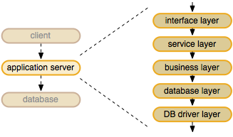

This chapter provides a global overview of the Enterprise architecture, followed by how Web Services fit into the big figure.

## 3-tier architecture

Enterprise uses a 3-tier architecture:

Users interact with *client applications*. They can use Content Station, Smart Connection InDesign / InCopy or a web browser running a web application. But also Smart Mover and Smart Connection for InDesign Server as well as third-party systems can act as a client when talking to the *application server*. All of these clients can request the *application server* through HTTP to run any of its Web Services. Enterprise Server is the *application server* and has all business logic to determine which actions are allowed, which triggers other actions, etc. The server connects through a database-independent module to the underlying SQL *database* and possibly file server to store the binary files.

## Application server layers

Zooming into the *application server* reveals the following layers:

An incoming Web Service request fired from a client arrives at the *interface layer*. This layer interprets the incoming structure and transforms it into a PHP object structure. The object structure is passed onto the *service* layer. The actual implementation is done at the *business layer*. This uses the *database layer* to transform the object structure into ‘generic’ SQL statements. The *DB driver layer* is responsible for translating the SQL statements into dedicated SQL for a specific database flavor, such as MySQL, MSSQL or Oracle.

## Client applications calling Web Services

Client applications connect to one or many interfaces through which they fire Web Service requests. At the application server, a Web Service comes into action. The following overview shows how that is done.

For example, an InDesign user has created a new document and is about to Check-In the layout. The Smart Connection plug-ins in *InDesign* are connected to the Enterprise Server through the *workflow interface*. On the user’s Check-In command, they fire a CreateObjects request through the *workflow interface*. The server invokes the *CreateObjects* service to store the layout.
