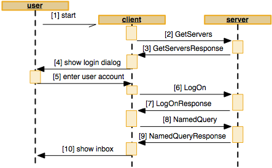

## Common sequences

Client applications implement all kinds of features by requesting services in the server. Many services stand on their own, but there are some logical sequences that are commonly used. This paragraph takes you by the hand running through the most important sequences while explaining the system at high level.

### Startup and login

The figure below shows an end user (on the lleft) working with a client application (center) which talks through SOAP with the server (right). When the user starts \[1\] the client application, it does some initialization and requests \[2\] the server to return \[3\] a list of the configured\* application servers.

\* Note: These servers are configured by admin users on the client machines (using the SCEnt:Servers setting in the WWSettings.xml file) or at a centralized server machine (using APPLICATION\_SERVERS setting in the configserver.php file). (For configuration details, see theAdmin Guide.) The example assumes that the application servers are configured server side. If not, steps \[2\] and \[3\] are skipped.

This list is shown \[4\] in the login dialog. The user enters his / her name and password, picks one of the listed application servers and submits \[5\] the dialog. The client requests the picked server to login \[6\] and passes the name and password entered by the user. The server checks the user account and returns \[7\] a newly created ticket to start a session. This ticket is used by the client for all next following requests.



Implicit to the login operation, clients fire a search request \[8\]. This can be the inbox (such as Content Station does) or the last-used query (such as InDesign does). The server runs the query in the database and returns \[9\] a list of objects. The client lists \[10\] the objects as rows in a table view.

### Editing a document

Once the client is started and the user is logged in, the user can start working. Let’s say that the user want to edit an article, layout or image. The figure below shows how that is done. The user picks \[1\] one of the listed objects from the query results. The client takes the object id of the selected row and requests \[2\] to lock that object id and retrieve the native file of the object. When not already locked, the server locks the object, retrieves the native file from the file store and sends \[3\] it back (as DIME attachment). The client saves the file locally and opens it \[4\] in its own application (such as InDesign) or starts another application (such as Photoshop). Now the user starts editing the file and does a check-in \[5\] once completed. The client requests \[6\] for the dialog definition. The server queries the definition (as defined on the admin pages) from the database and returns it \[7\]. The client builds the dialog based on the definition and shows \[8\] it to the user. The user adjusts some properties in the workflow dialog \[9\] such as the status. The client uploads \[10\] the file (as a DIME attachment) back to the server, which creates a new version and stores it in the file store. The updated object properties are returned \[11\] when successful. When the client did not unlock the object while saving \[10\], it unlocks afterwards \[13\] for which the server does return \[14\] no info.


## Object locking

Object files can be opened for editing by any user (with “Open for Edit” access rights). Doing so, objects are locked to prevent two users accidentally working on the same content at the same time. Once an object is locked, other users can read it, but cannot update the object files nor the object properties. Other aspects to objects are not locked though, such as targets, messages, and relations. Those could be changed by other users while the object is locked.

### Creating and opening

When creating new objects, the lock can be preserved to let the user continue editing the content. This is mostly done for a “Save Version” action of an article or layout for which a *CreateObjects* service is called, as shown in the fragment below. When the user does a “Check In” action to a new file, the same request is fired but then the *Lock* parameter is set to *false* instead. This is mostly done for new image file uploads.

```xml
<CreateObjects>
	<Ticket>5863c2527QG5KBoTnmSEX8yPrX6P9S1IF7Wxbnfj</Ticket>
	<Lock>true</Lock>
	<Objects>
		<Object>
			<MetaData>
				<BasicMetaData>
					<ID xsi:nil="true"/>
					...

```

For existing objects, a lock can be set through the *GetObjects* service by setting the *Lock* parameter to *true* as shown in fragment below.

```xml
<GetObjects>
	<Ticket>5863c2527QG5KBoTnmSEX8yPrX6P9S1IF7Wxbnfj</Ticket>
	<IDs>
		<String>1720</String>
	</IDs>
	<Lock xsi:type="xsd:boolean">true</Lock>
	...
</GetObjects>
```

### Storing and closing

When the user has changed the object properties and the object file content, a new version can be created, and the lock can be released simultaneously. For new objects, the *CreateObjects* service is called, and *SaveObjects* service for existing objects. This is mostly done for “Check In” actions, as shown here:

```xml
<SaveObjects>
	<Ticket>5863c2527QG5KBoTnmSEX8yPrX6P9S1IF7Wxbnfj</Ticket>
	<CreateVersion xsi:type="xsd:boolean">true</CreateVersion>
	<ForceCheckIn xsi:type="xsd:boolean">false</ForceCheckIn>
	<Unlock xsi:type="xsd:boolean">false</Unlock>
	<Objects>
		<Object>
			<MetaData>
				<BasicMetaData>
					<ID>1720</ID>
					...

```

Alternatively, when all object properties and file content is already saved before, just the lock can be released through the more cheaper *UnlockObjects* service as shown in the next fragment.

```xml
<UnlockObjects>
	<Ticket>5863c2527QG5KBoTnmSEX8yPrX6P9S1IF7Wxbnfj</Ticket>
	<IDs>
		<String>1720</String>
	</IDs>
	...
</UnlockObjects>
```

### Setting properties

Properties can be changed for a single object by using the *SetObjectProperties* service and for multiple objects (since 9.2) by using the *MultiSetObjectProperties* service. Note that most object properties can be changed, but the contents of the object files remains untouched and so properties that are strongly content related can also not be changed either. Because the Version property is content related, it won’t get increased.

There are two ways of locking, each with their own advantages and disadvantages:

* **Optimistic locking.** This method is used when the file was not previously locked by the client and the service is called directly. In this scenario, the file is not actually locked during the time the user updates the properties. It is assumed that the changes can be submitted without the file being locked by another user in the mean time. This method was implemented in Content Station 7.
* **Pessimistic locking.** In this method, the client application first locks the object (through *GetObjects* or *CreateObjects* service) and then calls the *SetObjectProperties* service. It then needs to release the lock through the *UnlockObjects* service afterwards. This way, before the dialog is shown to the user, it could already fail (when someone else has locked it in the meantime) and an error raises. This method was implemented in Smart Connection 7.

\[Since 9.2\] The *MultiSetObjectProperties* service is designed to simultaneously modify a few properties for many objects. For a selection of multiple objects, it is significantly faster to use this service than repeatedly calling the *SetObjectProperties* service for each object.

**Important notes for Server Plug-ins**:

* Instead of “Set Properties”, users can use the “Send To” or the “Send To Next” actions as well. Doing so, client applications fire the *SendTo* workflow request to the server. Internally, the server redirects this service to the *SetObjectProperties* service as soon as it arrives, even before any Server Plug-in connector is called. The *SendTo* service is actually a simplified version of the *SetObjectProperties* service. During redirection, the server enriches some object information such as the object targets. This is all done to simplify property interception using custom Server Plugins. In other terms, the *WflSendTo* service connector is never(!) called and *WflSetObjectProperties* is called instead.

* \[Since 9.2\] When implementing the *WlfSetObjectProperties* connector it is mandatory to also implement the *WflMultiSetObjectProperties* connector for the plug-in, and vice versa. Failure to do so will result in validation errors on the Server Plug-ins or Health Check pages.

* \[Since 9.2\] When implementing the *WlfSendTo* connector it is mandatory to also implement the *WflSendToNext* connector for the plug-in, and vice versa. Failure to do so will result in validation errors on the Server Plug-ins or Health Check pages.

## Automatic workflow status assignment \[since 8.2\]

Since Enterprise 8.2 it is allowed to create objects without specifying a status. Enterprise Server will then automatically take the first status configured in the workflow (for the given object type and Brand). When there are no statuses defined, but the Personal Status feature is enabled, a Personal Status will be assigned to the newly created object. SOAP clients calling the CreateObjects service should set the State to nil as follows:

```xml
<CreateObjects>
	<Objects>
		<Object>
			<MetaData>
				...
				<WorkflowMetaData>
					...
					<State xsi:nil="true">
					...
				</WorkflowMetaData>
				...
			</MetaData>
		</Object>
	</Objects>
</CreateObjects>
```
